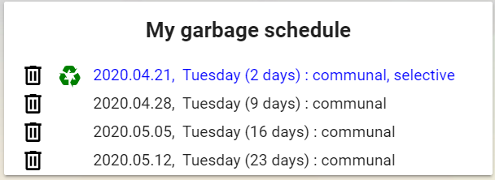

<p><a href="https://www.buymeacoffee.com/6rF5cQl" rel="nofollow" target="_blank"></a></p>

# FKF Budapest Garbage Collection custom component for Home Assistant

This custom component gathers garbage collection schedule from FKF Budapest Department of Public
for a configurable address.
The state of the sensor will be the number of days to the first upcoming garbage collection date.
The sensor will also report in an attribute the status of the latest data fetch.

#### Installation
The easiest way to install it is through [HACS (Home Assistant Community Store)](https://custom-components.github.io/hacs/),
search for <i>FKF Budapest Garbage</i> in the Integrations.<br />

Sensors of this platform should be configured as per below information.

#### Configuration:
Define sensors with the following configuration parameters according to [FKF Hulladéknaptár](https://www.fkf.hu/hulladeknaptar/).<br />

---
| Name | Optional | `Default` | Description |
| :---- | :---- | :------- | :----------- |
| name | **Y** | - | sensor of fkf_garbage_collection type |
| zipcode | **N** | - | ZIP code |
| publicplace | **N** | - | Name of public place |
| housenr | **N** | - | House number |
---

#### Example
```
platform: fkf_garbage_collection
name: 'fkf_my_schedule'
zipcode: '1013'
publicplace: 'Attila út'
housenr: '69'
```

#### Lovelace UI
There is a Lovelace custom card related to this component at [https://github.com/amaximus/fkf-garbage-collection-card](https://github.com/amaximus/fkf-garbage-collection-card).

#### Custom Lovelace card example:<br />


#### Home Assistant Companion App notification example
You can set up an automation to get a notification on your phone so you don't forget to pull out the trash bins:

```yaml
- alias: 'Tedd ki a szemetet'
  trigger:
    - platform: time
      at: '18:00:00'
  condition:
    condition: and
    conditions:
    - condition: state
      entity_id: 'person.me'
      state: 'home'
    - condition: state
      entity_id: sensor.fkf_hulladek
      state: '0'
  action:
    - choose:
        - conditions:
            - condition: template
              value_template: "{{ is_state_attr('sensor.fkf_hulladek', 'garbage0', 'communal') }}"
          sequence:
            - service: notify.mobile_app_me
              data:
                title: 'Tedd ki a szemetet!'
                message: 'A kommunális :wastebasket: -át ma ki kell tolni.'
                data:
                  channel: Kuka
                  clickAction: /lovelace/default_view
        - conditions:
            - condition: template
              value_template: "{{ is_state_attr('sensor.fkf_hulladek', 'garbage0', 'selective') }}"
          sequence:
            - service: notify.mobile_app_me
              data:
                title: 'Tedd ki a szemetet!'
                message: 'A szelektív :wastebasket: -át ma ki kell tolni.'
                data:
                  channel: Kuka
                  clickAction: /lovelace/default_view
      default:
        - service: notify.mobile_app_me
          data:
            title: 'Tedd ki a szemetet!'
            message: 'A :wastebasket: -át ma ki kell tolni.'
            data:
              channel: Kuka
              clickAction: /lovelace/default_view
```
